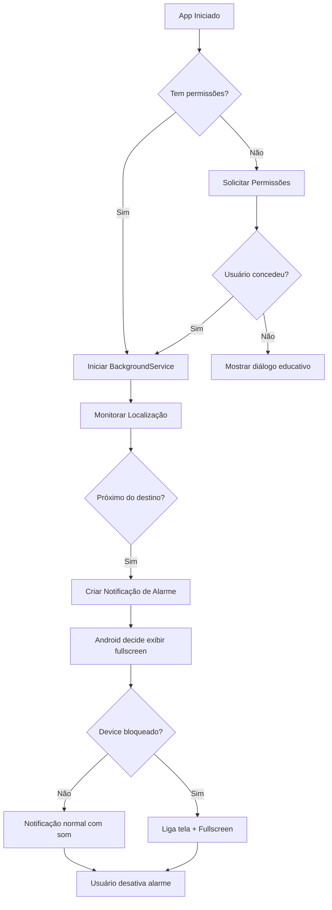

# 📱 AVISA LÁ - Refatoração como Aplicativo de Alarme

## ✅ Mudanças Implementadas

### 1. **AndroidManifest.xml - Permissões de Alarme**

Adicionadas **permissões obrigatórias** para aplicativos de alarme conforme [Google Best Practices](https://developer.android.com/training/scheduling/alarms):

```xml
<!-- ⏰ PERMISSÕES ESPECÍFICAS PARA APPS DE ALARME -->

<!-- Android 10+: Permite notificações fullscreen sobre lockscreen -->
<uses-permission android:name="android.permission.USE_FULL_SCREEN_INTENT" />

<!-- Android 12+: Permite agendar alarmes exatos (requer aprovação do usuário) -->
<uses-permission android:name="android.permission.SCHEDULE_EXACT_ALARM" />

<!-- Android 13+: Alarmes exatos para funções core (não requer aprovação) -->
<uses-permission android:name="android.permission.USE_EXACT_ALARM" />

<!-- Android 12+: Permite foreground service com tipo specialUse -->
<uses-permission android:name="android.permission.FOREGROUND_SERVICE_SPECIAL_USE" />

<!-- Reiniciar alarmes após reboot -->
<uses-permission android:name="android.permission.RECEIVE_BOOT_COMPLETED" />

<!-- Desabilitar otimizações de bateria (solicitar ao usuário) -->
<uses-permission android:name="android.permission.REQUEST_IGNORE_BATTERY_OPTIMIZATIONS" />
```

### 2. **MainActivity - Configuração de Alarme**

A `MainActivity` agora está configurada como **Activity de Alarme**:

```xml
<activity
    android:name=".MainActivity"
    ...
    <!-- ⏰ CONFIGURAÇÕES ESPECÍFICAS DE ALARME -->
    android:showWhenLocked="true"       <!-- Aparece sobre lockscreen -->
    android:turnScreenOn="true"         <!-- Liga a tela automaticamente -->
    android:showForAllUsers="true">     <!-- Funciona em multi-usuário -->
```

**Métodos nativos adicionados** (Kotlin):
- `canScheduleExactAlarms()` - Verifica permissão Android 12+
- `openAlarmPermissionSettings()` - Abre configurações do sistema

### 3. **NotificationService - Notificações de Alarme Críticas**

A notificação agora segue o padrão de **alarme crítico**:

```dart
AndroidNotificationDetails(
  importance: Importance.max,              // CRÍTICA
  priority: Priority.max,                  // MÁXIMA PRIORIDADE
  category: AndroidNotificationCategory.alarm, // CATEGORIA ALARME
  fullScreenIntent: true,                  // ⏰ FULLSCREEN INTENT
  autoCancel: false,                       // Não cancela automaticamente
  ongoing: true,                           // Persiste até ação do usuário
  visibility: NotificationVisibility.public, // Aparece sobre lockscreen
  // ... som e vibração intensos
)
```

**Características:**
- ✅ Vibração forte e persistente
- ✅ Som de alarme (customizável)
- ✅ LED vermelho piscando
- ✅ Aparece sobre lockscreen
- ✅ Ações: "Desativar" e "Cheguei"

### 4. **AlarmPermissionsManager - Gerenciamento de Permissões**

Novo arquivo: `lib/core/utils/alarm_permissions.dart`

**Fluxo de solicitação de permissões**:

1. **Notificações** (Android 13+)
2. **Localização** (em uso → background)
3. **Alarmes Exatos** (Android 12+ → abre Settings)
4. **Otimização de Bateria** (opcional, mas recomendado)

**Métodos principais**:
```dart
// Verificar se todas permissões estão concedidas
AlarmPermissionsManager.hasAllAlarmPermissions()

// Solicitar todas permissões (com diálogos educativos)
AlarmPermissionsManager.requestAllAlarmPermissions(context)

// Mostrar diálogo se permissões foram negadas
AlarmPermissionsManager.showPermissionDeniedDialog(context)
```

### 5. **BackgroundService - Tipo de Serviço**

O serviço foreground agora é do tipo **location + specialUse**:

```xml
<service
    android:name="id.flutter.flutter_background_service.BackgroundService"
    android:foregroundServiceType="location|specialUse"
    ...>
    <!-- Propriedade obrigatória para SPECIAL_USE (Android 14+) -->
    <property
        android:name="android.app.PROPERTY_SPECIAL_USE_FGS_SUBTYPE"
        android:value="alarm_clock" />
</service>
```

### 6. **BootReceiver - Reinício após Reboot**

Novo arquivo: `android/.../BootReceiver.kt`

**Garante que alarmes sejam recarregados** após reinicialização do device:

```kotlin
class BootReceiver : BroadcastReceiver() {
    override fun onReceive(context: Context?, intent: Intent?) {
        if (intent?.action == Intent.ACTION_BOOT_COMPLETED) {
            // Preparar para reiniciar alarmes salvos
        }
    }
}
```

---

## 📋 Como Usar as Novas Permissões

### No início do app (ou antes de criar alarme):

```dart
import 'package:avisa_la/core/utils/alarm_permissions.dart';

// Verificar se possui todas permissões
final hasPermissions = await AlarmPermissionsManager.hasAllAlarmPermissions();

if (!hasPermissions) {
  // Solicitar permissões com diálogos educativos
  final granted = await AlarmPermissionsManager.requestAllAlarmPermissions(context);
  
  if (!granted) {
    // Mostrar diálogo explicando que permissões são necessárias
    await AlarmPermissionsManager.showPermissionDeniedDialog(context);
    return;
  }
}

// ✅ Permissões OK - pode criar alarmes
```

---

## ⚠️ Diferenças do Comportamento Anterior

### **ANTES** (tentativa de forçar abertura):
- ❌ Tentava usar `FLAG_ACTIVITY_BRING_TO_FRONT` manualmente
- ❌ Criava `AlarmReceiver` para interceptar broadcasts
- ❌ Não solicitava `SCHEDULE_EXACT_ALARM` corretamente
- ❌ Violava restrições do Android 12+ (BAL - Background Activity Launch)

### **AGORA** (seguindo melhores práticas):
- ✅ Declara app como **ALARM APP** no manifest
- ✅ Solicita `USE_FULL_SCREEN_INTENT` explicitamente
- ✅ Solicita `SCHEDULE_EXACT_ALARM` com UX educativa
- ✅ Notificação com categoria `AndroidNotificationCategory.alarm`
- ✅ `fullScreenIntent: true` ativa automaticamente
- ✅ **Sistema Android** decide quando mostrar fullscreen (não o app)

---

## 🔍 Comportamento Esperado

### **Android 12+** (com permissões corretas):

1. **App em foreground**: Notificação aparece normalmente
2. **App em background**: Notificação aparece com som/vibração forte
3. **Device bloqueado**: 
   - ✅ **Se `SCHEDULE_EXACT_ALARM` concedido**: Notificação pode aparecer fullscreen
   - ✅ **Se `USE_FULL_SCREEN_INTENT` concedido**: Tela liga automaticamente
   - ⚠️ **Sistema decide** se mostra fullscreen (baseado em prioridade e estado do device)

### **Android 10-11**:
- Comportamento similar, mas sem restrições de `SCHEDULE_EXACT_ALARM`

### **Android 9 e inferior**:
- Todas permissões concedidas automaticamente
- Comportamento mais permissivo

---

## 🚨 Pontos de Atenção

### 1. **`SCHEDULE_EXACT_ALARM` pode ser REVOGADA**
- Usuário pode desativar em Settings → Apps → Avisa Lá → Alarmes e lembretes
- App deve verificar periodicamente com `canScheduleExactAlarms()`
- Implementar `BroadcastReceiver` para `ACTION_SCHEDULE_EXACT_ALARM_PERMISSION_STATE_CHANGED`

### 2. **Otimizações de Bateria**
- Fabricantes (Samsung, Xiaomi, Huawei) têm otimizações agressivas
- Usuário deve adicionar app à **whitelist de bateria**
- Pode ser necessário **guia específico por fabricante**

### 3. **Google Play Policy**
- `USE_EXACT_ALARM` só pode ser usado para **funções core**
- `SCHEDULE_EXACT_ALARM` requer **justificativa no formulário do Play Console**
- [Política de Alarmes Exatos](https://support.google.com/googleplay/android-developer/answer/12253906)

### 4. **Testes**
- Testar em **dispositivos físicos** (emulador pode não simular corretamente)
- Testar com **device bloqueado e tela desligada**
- Testar após **reboot do device**
- Testar com **app completamente fechado** (force stop)

---

## 📱 Fluxo Completo de Funcionamento



---

## 🔧 Próximos Passos Recomendados

1. **Adicionar som personalizado de alarme** (`assets/sounds/alarm_sound.mp3`)
2. **Implementar `ACTION_SCHEDULE_EXACT_ALARM_PERMISSION_STATE_CHANGED`**
3. **Criar guia de configuração por fabricante** (Samsung, Xiaomi, etc)
4. **Adicionar testes de integração** para permissões
5. **Documentar no Google Play** a justificativa para `USE_EXACT_ALARM`

---

## 📚 Referências Oficiais

- [Schedule Alarms - Android Developers](https://developer.android.com/training/scheduling/alarms)
- [SCHEDULE_EXACT_ALARM Permission](https://developer.android.com/reference/android/Manifest.permission#SCHEDULE_EXACT_ALARM)
- [USE_FULL_SCREEN_INTENT Permission](https://developer.android.com/reference/android/Manifest.permission#USE_FULL_SCREEN_INTENT)
- [Behavior Changes: Android 12](https://developer.android.com/about/versions/12/behavior-changes-12#exact-alarm-permission)
- [Google Play Exact Alarm Policy](https://support.google.com/googleplay/android-developer/answer/12253906)

---

**Última atualização**: 2025-01-XX  
**Versão do app**: Pós-refatoração como Alarm App
